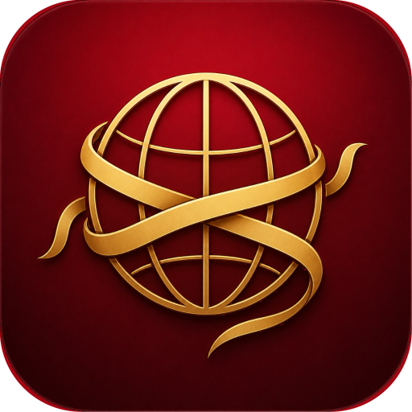

# World Weaver



A local-first desktop campaign manager for tabletop GMs. Keep worlds, campaigns, people, lore, sessions, battle maps, and dice in one app that runs entirely on your computer.

World Weaver is built with [Compose Multiplatform](https://www.jetbrains.com/compose-multiplatform/) for **macOS**, **Windows**, and **Linux**. There is no account, no cloud sync, and no always-on network requirement. Your setting lives in `~/.worldweaver` and can be copied with world bundles or full-machine backups.

[Install](#install) · [User guide](docs/USER_GUIDE.md) · [Foundry](docs/FOUNDRY.md) · [Build from source](#build-from-source)

## What you can do

- **Worlds and campaigns** — Maintain a library of settings, each with one or more play-throughs. Choose **5E** or **PF2E** per world (campaigns can override).
- **One-shot wizard** — Walk through identity, hook, places, people, conflict, and table plan, then generate a starter world and campaign.
- **Places and world maps** — Nest continents, areas, cities, and places. Import PNG maps, pin child locations, and drill into nested cartography.
- **Lore, calendar, factions, and links** — Write setting entries (including DM-only secrets), keep an in-world calendar with holidays and important days, track factions, and browse a relationship web.
- **People and sheets** — Create PCs, NPCs, and monsters. Open a dedicated character sheet window with HP, abilities, spells, and gear. Optional 5E SRD import fills race, class, spell, and monster pickers.
- **Sessions and tonight** — Plan recaps, scenes, and plot threads. From Home, **Continue tonight** opens the run screen for the active session: party, objectives, notes, maps, and encounters.
- **Battle maps and combat** — Import grid maps, measure, paint fog of war, place tokens, and open a **Player view** window for the table. Run initiative, HP, conditions, and death saves from Encounters.
- **Dice** — Roll digital dice (including advantage/disadvantage) or log table faces. Pop the tray out and keep it always on top.
- **Search** — Find worlds, campaigns, locations, lore, factions, people, quests, and sessions from the top bar.
- **Backup** — Export or restore a `.wwbackup` of this machine’s data. Share a single world as a `.wwbundle`.

## Install

Download the latest installer from [Releases](https://github.com/kmbisset89/WorldWeaver/releases):

| Platform | File |
|----------|------|
| macOS | `.dmg` |
| Windows | `.exe` |
| Linux | `.deb` |

World Weaver stores data under `~/.worldweaver` (database, avatars, maps, voice clips, and imported SRD). Changing machines is a Settings backup/restore, not a cloud login.

Try a sample setting from this repo: **Worlds → Import world**, then choose `fixtures/demo-campaign.wwbundle`.

## User guide

The [user guide](docs/USER_GUIDE.md) covers first launch, building a world, preparing a session, running combat with player view, dice, backups, and where files live.

World Weaver does not replace Foundry as a remote VTT. To hand maps or a world bible to Foundry (one-way file export, no live sync), see [World Weaver and Foundry VTT](docs/FOUNDRY.md).

## Build from source

Requires **JDK 17**.

```bash
./gradlew run
./gradlew test
```

Native packages (same formats CI publishes):

```bash
./gradlew packageReleaseDmg    # macOS
./gradlew packageReleaseExe    # Windows
./gradlew packageReleaseDeb    # Linux
```

## License

[Apache License 2.0](LICENSE)

World Weaver is an independent tool. It is not affiliated with Wizards of the Coast, Paizo, or any other publisher. “5E” and “PF2E” in the app refer to the game systems you choose for a world; import only SRD or other content you have the right to use.
